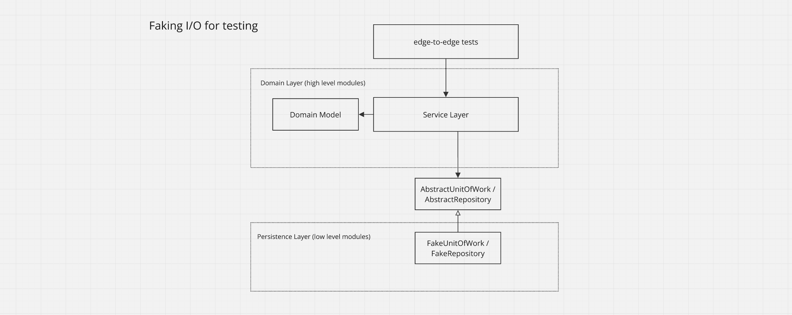
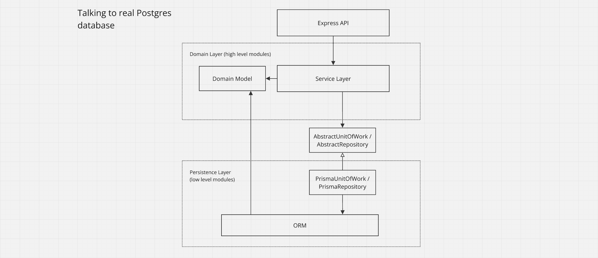

# Allocation Service

Backend API for allocating customer orders to batches of stock in a warehouse.

### Stack
- Python
- PostgreSQL
- Flask
- SqlAlchemy
- Docker

---

### Architecture

The application uses the [dependency inversion principle](https://en.wikipedia.org/wiki/Dependency_inversion_principle), and creates abstractions around I/O and injects them. This allows us to pass a fake I/O to the service layer for testing the application "edge-to-edge" with fast, in-memory unit tests.

---

For real-world and E2E testing, the service layer is passed real I/O that talks to a database. Because we have already exhaustively tested the service layer with fast, in-memory tests, less slow E2E tests are needed. We can achieve a healthy testing pyramid with high coverage.

---

A few patterns are used to aid dependency inversion.

**Repository** - an abstraction around data access. Handles syncing between the domain model and the ORM. 
**Unit of Work** - an abstraction around transactions and atomicity. 
**Service Layer** - the entrypoint for injecting I/O and defines the application's use cases. 
**Domain Model** - an object module of the business domain free of dependencies on data access. 
**Data Mapper** - handles conversion between domain objects and db objects. 

**Trade-offs** - Each pattern adds indirection and congintive load and wouldn't be necessary in a simple application. You could, for example, still achieve dependency inversion and abstracting I/O with only a simple repository and a service layer.
